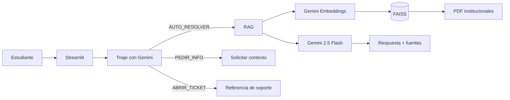

<p align="center"></p>

# NexoAula: agente educativo con RAG

Agente de inteligencia artificial que responde preguntas sobre una escuela online utilizando exclusivamente documentos institucionales. El proyecto implementa triaje, recuperación semántica, respuestas con fuentes y escalamiento de casos que requieren revisión humana.

## Problema que resuelve

Los estudiantes suelen consultar la misma información en distintos canales: requisitos de certificación, reembolsos, acceso, becas y afiliados. NexoAula centraliza esas reglas en una base conversacional y reduce respuestas inconsistentes.

## Documentación incluida

1. Reglamento del estudiante.
2. Política de reembolso de matrículas.
3. Preguntas frecuentes sobre cursos y certificados.
4. Guía de uso de la plataforma.
5. Programa de becas y afiliados.

Los PDF usados por el RAG se encuentran en `docs/knowledge_base/`; las versiones editables en `docs/editable/` y las fuentes Markdown en `docs/source/`.

## Arquitectura



## Tecnologías

- Python 3.12
- Gemini 2.5 Flash
- Gemini Embedding 001
- LangChain
- LangGraph
- FAISS
- PyMuPDF
- Streamlit
- Docker
- Oracle Cloud Infrastructure: OCI Compute

## Flujo del agente

1. El triaje clasifica la consulta como `AUTO_RESOLVER`, `PEDIR_INFO` o `ABRIR_TICKET`.
2. Las preguntas informativas pasan al RAG.
3. La pregunta y los documentos se convierten en embeddings con el mismo modelo.
4. FAISS recupera los fragmentos más similares.
5. Gemini responde solo con ese contexto.
6. La interfaz muestra archivo, página y extracto de cada fuente.
7. Cuando no hay respaldo suficiente, el agente no inventa una respuesta.

## Ejecución local

```bash
python -m venv .venv
# Windows
.venv\Scripts\activate
# macOS/Linux
source .venv/bin/activate

pip install -r requirements.txt
cp .env.example .env
# Edita .env y agrega GEMINI_API_KEY
streamlit run app.py
```

La primera consulta crea el índice vectorial en `data/index/`. También puede generarse antes con:

```bash
python scripts/build_index.py
```

## Docker

```bash
cp .env.example .env
docker compose up --build -d
```

Abre `http://localhost:8501`.

## Pruebas

```bash
pytest
python scripts/check_policy_consistency.py
python scripts/smoke_test.py
```

El último comando consume la API de Gemini.

## Preguntas de ejemplo

- ¿Qué necesito para obtener el certificado?
- ¿Puedo solicitar un reembolso si avancé 10 %?
- ¿Puedo usar inteligencia artificial en mis tareas?
- ¿Qué cobertura ofrecen las becas?
- ¿Cuál es la comisión del programa de afiliados?

## Ejemplo de respuesta esperada

> Para obtener el certificado debes completar al menos el 80 % del contenido obligatorio, alcanzar una nota final mínima de 70/100 y no tener sanciones pendientes.
> Fuente: `01_reglamento_estudiante.pdf`, sección Certificación.

## Despliegue en OCI

Sigue [DEPLOY_OCI.md](DEPLOY_OCI.md). El requisito mínimo se cumple con una instancia OCI Compute que ejecute el contenedor Docker.

### Evidencia del despliegue


**URL pública:** [`DESPLIEGUE`](https://nexoaula-agente-rag-tmugba4cjgbh8ktrrpvm3z.streamlit.app/)

## Estructura

```text
app.py
src/                 lógica del agente, RAG, triaje y logs
docs/knowledge_base/ PDF que consulta el agente
docs/editable/       documentos DOCX editables
docs/source/         versiones Markdown
scripts/              construcción, validación y pruebas
evaluation/           banco de preguntas y guía de evaluación
notebooks/            versión didáctica para Google Colab
```

## Seguridad

- Nunca subas `.env` ni una API key.
- El índice FAISS se carga solo desde una ubicación controlada.
- Los logs no deben almacenar contraseñas ni datos bancarios completos.
- Antes de un uso real, adapta políticas, privacidad, soporte y tratamiento de datos a la jurisdicción aplicable.

## Estado del proyecto

Código, documentos, pruebas y despliegue Docker: completos. El repositorio público y el despliegue real en OCI requieren las credenciales del propietario.

## Licencia

Código bajo licencia MIT. Los documentos son material de demostración académica.
